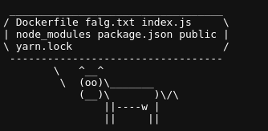

# Platform: PicoCTF
# Name: caas
## Type: Web

Following the link we get to this page:


Following the instructions on the page I get this:


Trying special character I find that ';' does not work.


So I'll try bash payloads.

Payload:

```bash
$(ls)
```



Now that I know I'll just read the file.

Payload:

```bash
$(cat falg.txt)
```


# We got the flag!